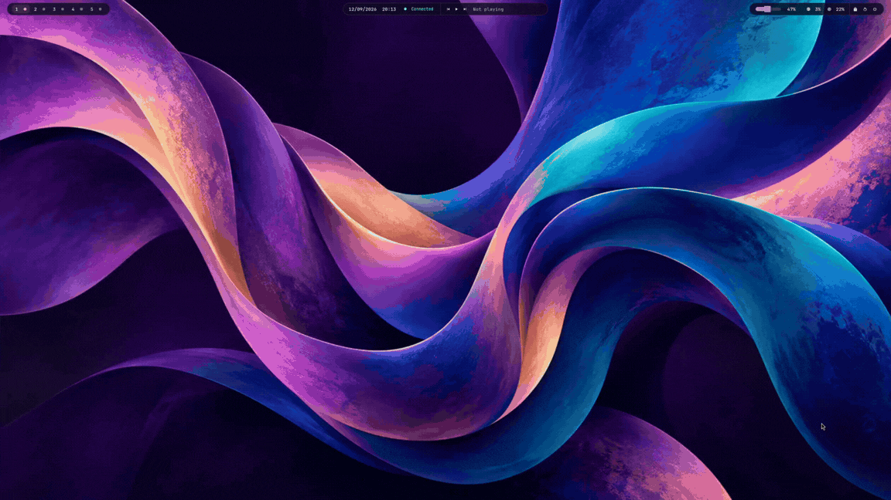
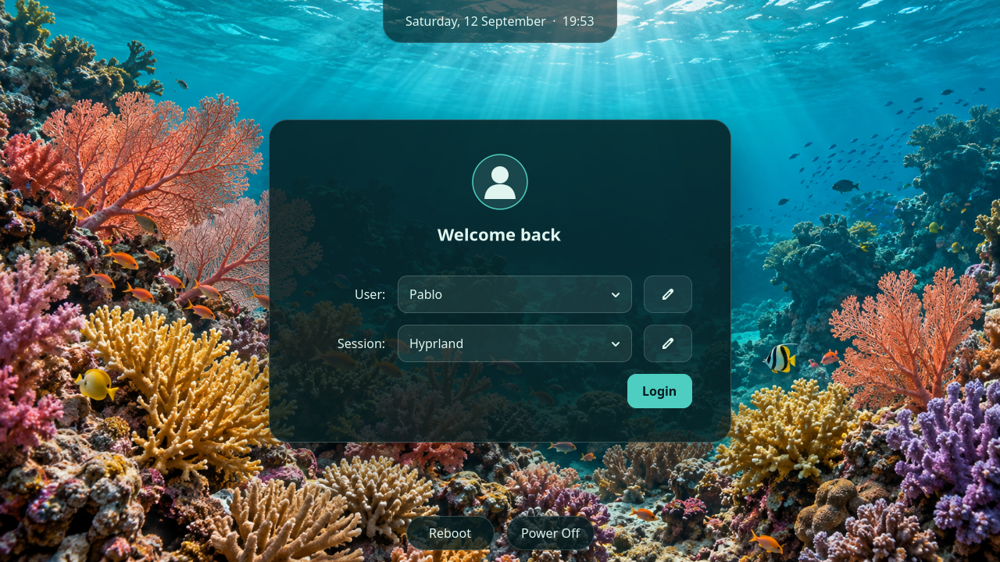

# Hyprach | Archlinux + Hyprland

A themed Arch Linux + Hyprland desktop with five looks—**Verdant, Abyss, Mono, Abstract, and Reef**—and a matching graphical login screen. Switch themes with **Super + W**.

## Demo



## How to apply the scripts

Start from an existing Arch Linux installation with Hyprland. Install the [required packages](#required-packages) below, then open a terminal in this repository.

1. **Check your display settings.** Edit `.config/hypr/config/monitors.lua` to match your monitor name, resolution, and refresh rate. Run `hyprctl monitors` to see your display details. You can also change the keyboard layout in `.config/hypr/config/input.lua`.

2. **Apply the desktop configuration as your normal user:**

   ```bash
   mkdir -p ~/Pictures/Screenshots
   ./apply_changes.sh
   ```

   Do **not** use sudo for this script. It copies the configuration, applies your saved theme, and refreshes the desktop. Verdant is selected on first use. Existing matching files are backed up to `~/.config/backup/last`; each run replaces that backup.

3. **Set up the graphical login screen:**

   ```bash
   sudo ./setup_greeter.sh
   ```

   This installs ReGreet and its dependencies, sets up the themed login screen, and enables greetd. It does not end your current session. Reboot when ready, select your user and **Hyprland**, and log in. Your user and session are remembered for future logins.



4. **Choose your theme.** Press **Super + W**, select a theme, and press Enter or click. Press Escape to cancel. Your choice is saved for future logins and also updates the login screen's theme.

After the first installation, close Thunar once all file operations finish (`thunar -q`), then reopen it to load the shared styling. Future theme switches do not close your applications.

Run `./apply_changes.sh` again whenever you update the desktop configuration. If you add themes or change their colors, wallpapers, or login styling, also rerun `sudo ./setup_greeter.sh` to update the login screen's assets.

If you need to restore the original text login, switch to another terminal with **Ctrl + Alt + F3**, log in, and run:

```bash
sudo cp /var/backups/dotfiles-greetd/original-config.toml /etc/greetd/config.toml
sudo systemctl restart greetd
```

The last command restarts the login service and can end the graphical session.

## Keybinds

**Super** is usually the Windows key. For shortcuts with **R**, hold Super and R while pressing the final key.

| Shortcut | Action |
| --- | --- |
| **Super + Enter** | Open Alacritty terminal |
| **Super + Space** | Open the application launcher |
| **Super + W** | Open the theme selector |
| **Super + T** | Open Thunar file manager |
| **Super + B** | Open Chromium |
| **Super + V** | Launch Neovim |
| **Super + C** | Open Cursor |
| **Super + M** | Open Spotify |
| **Super + N** | Open Discord |
| **Super + Q** | Close the active window |
| **Super + G** | Toggle floating mode |
| **Super + F** | Toggle fullscreen |
| **Super + H / J / K / L** | Focus left / down / up / right |
| **Super + Shift + H / J / K / L** | Move the window left / down / up / right |
| **Super + R + H / L** | Decrease / increase window width |
| **Super + R + J / K** | Decrease / increase window height |
| **Super + 1–5** | Switch workspace |
| **Super + Shift + 1–5** | Move the active window to a workspace |
| **Super + left mouse drag** | Move the active window |
| **Super + right mouse drag** | Resize the active window |
| **Super + D** | Save a full-screen screenshot |
| **Super + S** | Select a region and save a screenshot |
| **Super + Shift + R** | Reload Hyprland configuration |
| **Super + Shift + Q** | Log out of Hyprland |
| **Volume up / down** | Adjust volume in 5% steps |
| **Mute / microphone mute** | Toggle speaker / microphone mute |
| **Brightness up / down** | Adjust brightness on supported displays |
| **Media play / pause** | Toggle playback |
| **Media next / previous** | Skip to the next / previous track |

Screenshots are saved in `~/Pictures/Screenshots`. Customize shortcuts and default applications in `.config/hypr/config/keybinds.lua`.

## Required packages

Hyperach uses Hyprland's **Lua configuration format**. Use a current Arch Linux installation with a Lua-capable Hyprland build.

Install the desktop components, audio tools, fonts, and shortcut helpers:

```bash
sudo pacman -S --needed \
  hyprland hyprpaper waybar wofi mako alacritty thunar \
  python glib2 procps-ng polkit-gnome \
  pipewire pipewire-pulse wireplumber pavucontrol networkmanager \
  grim slurp wl-clipboard playerctl brightnessctl libnotify hyprlock \
  ttf-jetbrains-mono-nerd noto-fonts noto-fonts-emoji adwaita-icon-theme
```

For the graphical login screen and text-login fallback:

```bash
sudo pacman -S --needed greetd greetd-agreety greetd-regreet cage
```

ReGreet's dependencies, including AccountsService and GTK 4, are installed automatically. The setup script also installs ReGreet and Cage if needed.

The default application shortcuts and terminal startup use these packages:

```bash
sudo pacman -S --needed chromium neovim fastfetch spotify-launcher discord
```

**Cursor** is available from the AUR as `cursor-bin`. You can replace any default application by editing the keybind configuration instead of installing it. `rsync` is optional; the apply script uses `cp` when it is unavailable.

These scripts configure an existing system; they do not install Arch Linux or set up your graphics drivers and network connection. The Waybar lock button uses `hyprlock`, which needs your own lock-screen configuration.
